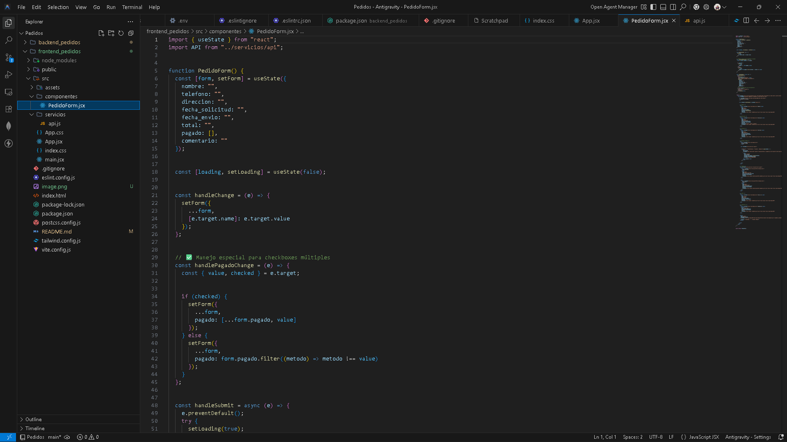
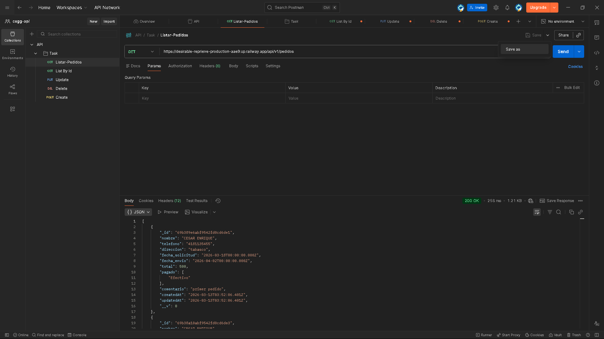
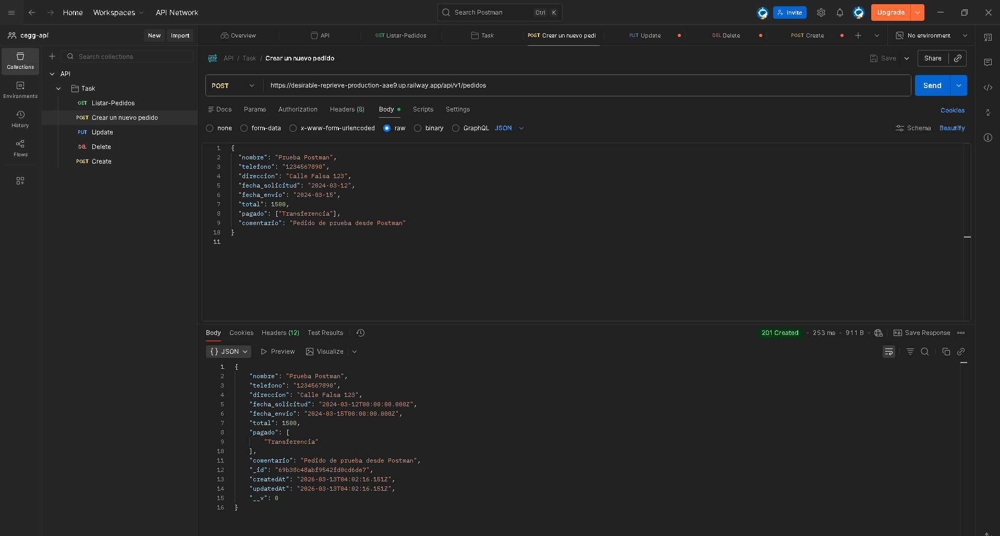
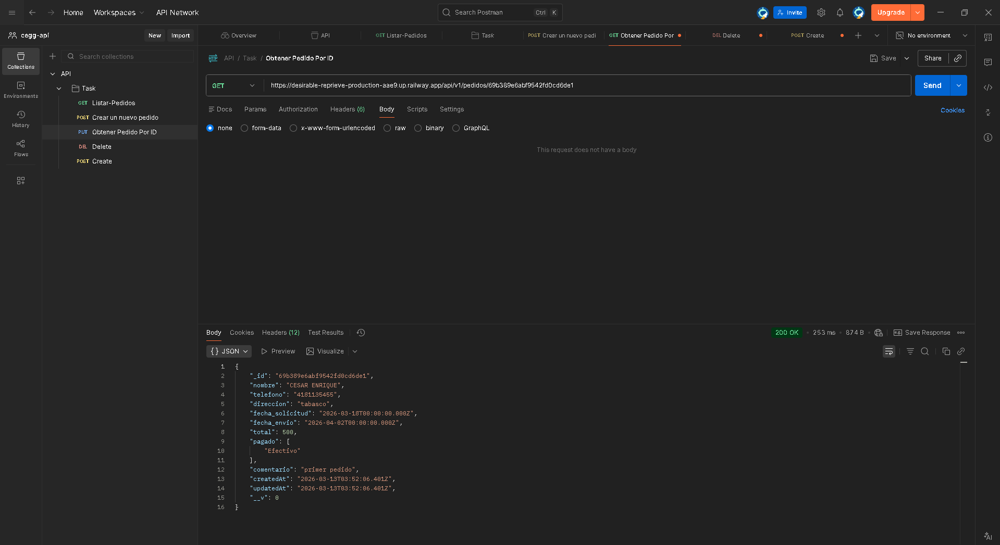
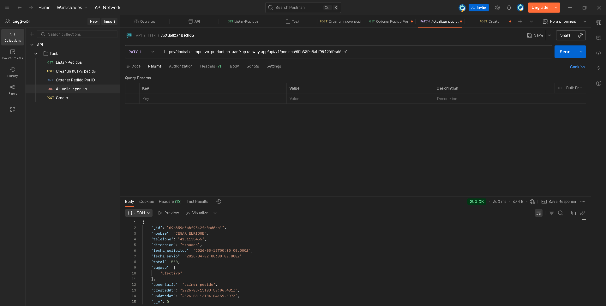
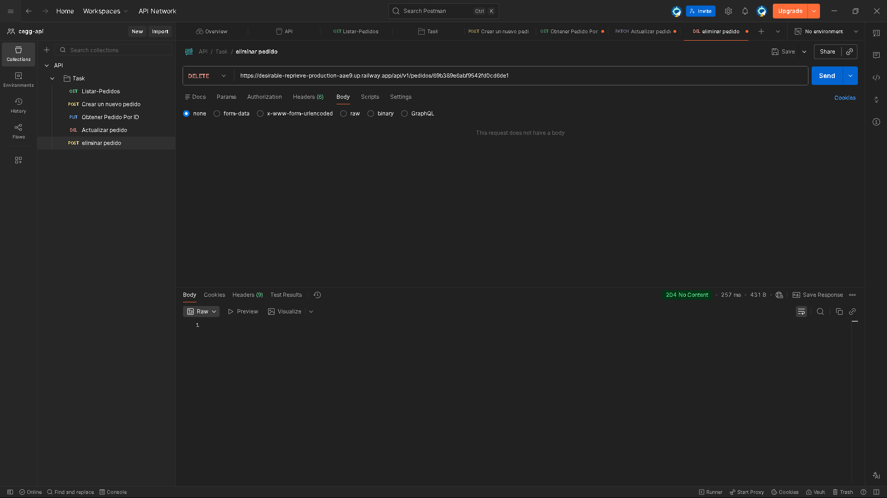

# 📦 Sistema de Gestión de Pedidos - Full Stack

Este es un sistema robusto para la gestión de pedidos, desarrollado con un enfoque profesional, conectando un frontend moderno en React con un backend escalable en Node.js y una base de datos MongoDB.

## 🚀 Despliegue en Producción

- **Frontend:** [pedidos-production-edf9.up.railway.app](https://pedidos-production-edf9.up.railway.app/)
- **Backend (API):** [desirable-reprieve-production-aae9.up.railway.app/api/v1](https://desirable-reprieve-production-aae9.up.railway.app/api/v1)

---

## 🛠️ Tecnologías Utilizadas

### Frontend
- **React.js + Vite**: Para una interfaz rápida y reactiva.
- **Tailwind CSS**: Diseño moderno y responsivo.
- **Axios**: Comunicación fluida con la API.

### Backend
- **Node.js + Express**: Servidor escalable y eficiente.
- **MongoDB + Mongoose**: Base de Datos NoSQL para persistencia flexible.
- **CORS & Body-Parser**: Middleware para seguridad y manejo de datos.

---

## 📸 Capturas de Pantalla (Galería)

| Registro de Pedidos | Interfaz Principal |
|:---:|:---:|
|  |  |
|  |  |
|  |  |

---

## 📂 Estructura del Proyecto

```text
/
├── backend_pedidos/    # Código del servidor y base de datos
└── frontend_pedidos/   # Interfaz de usuario y componentes
```

---

## 🔑 Endpoints de la API

| Método | Endpoint | Descripción |
| :--- | :--- | :--- |
| **GET** | `/pedidos` | Lista todos los pedidos. |
| **POST** | `/pedidos` | Crea un nuevo pedido (Requiere `direccion`). |
| **PATCH** | `/pedidos/:id` | Actualiza un pedido. |
| **DELETE** | `/pedidos/:id` | Elimina un pedido. |

---

## 🔧 Instalación Local

1. Clona el repositorio.
2. Configura los `.env` con tu `DATABASE_URL` y `PORT`.
3. Ejecuta `npm install` en ambas carpetas.
4. Usa `npm run dev` para iniciar el desarrollo.

---
